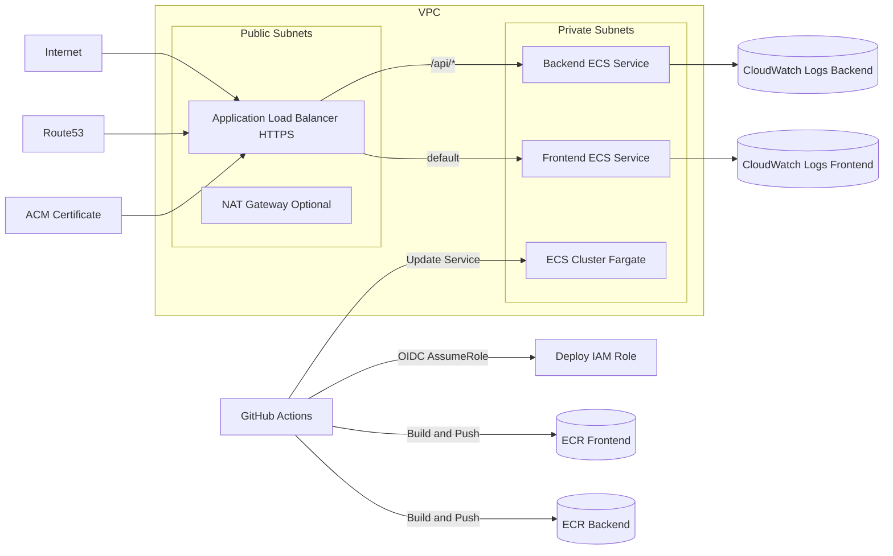

# Restaurant Ordering Platform Infrastructure

This repository section provides production-grade AWS infrastructure and CI/CD foundation for a QR-first restaurant ordering platform.

## Scope

Implemented in this phase:

- AWS ECS Fargate platform for frontend and backend
- ALB with HTTPS termination and routing rules
- Route53 DNS integration and ACM certificate automation
- ECR image repositories for frontend and backend
- GitHub Actions OIDC federation to AWS IAM role (no long-lived AWS keys)
- CloudWatch logs, baseline alarms, and deployment-ready ECS services
- Environment separation for `dev` and `prod`

Not implemented in this phase:

- Business application functionality
- Persistent data stores (RDS/ElastiCache resources are placeholders only)

## Architecture

## Repository Layout

- `infra/`: Root Terraform modules and composition
- `infra/modules/vpc`: VPC, subnets, IGW, NAT, route tables
- `infra/modules/security-groups`: ALB/service SGs and RDS SG placeholder
- `infra/modules/ecs-cluster`: ECS cluster
- `infra/modules/ecs-service`: Task definitions, roles, log groups, ECS service
- `infra/modules/alb`: ALB listeners, target groups, routing rules
- `infra/modules/ecr`: Frontend/backend repositories and lifecycle policies
- `infra/modules/acm`: ACM certificate and optional DNS validation
- `infra/modules/route53`: Alias records to ALB
- `infra/modules/iam-github-oidc`: OIDC provider + deploy role + least privilege policy
- `infra/envs/dev`: Dev environment entrypoint and sample values
- `infra/envs/prod`: Prod environment entrypoint and sample values

## Naming and Tagging

Resources follow:

- `{project}-{env}-{component}`

Tags applied globally:

- `Project`
- `Environment`
- `ManagedBy=Terraform`
- `Owner`
- `Component` (module/resource-specific)

## Environment Strategy

Branch to environment:

- `develop` -> `dev`
- `main` -> `prod`

Infra separation:

- Separate Terraform entrypoints: `infra/envs/dev`, `infra/envs/prod`
- Separate remote state keys (recommended): `infra/dev/terraform.tfstate`, `infra/prod/terraform.tfstate`
- Separate ECS services and task families per environment
- Separate ECR repositories per environment
- Separate GitHub environments: `dev`, `prod`

## Routing Model

Default recommended setup:

- Frontend domain: `app.example.com`
- Backend route: `app.example.com/api/*`

Alternative host-based API mode is supported by setting:

- `backend_routing_mode = "host"`
- `api_domain_name = "api.example.com"`

## Security Controls

Implemented controls:

- ECS tasks run in private subnets
- ALB only in public subnets
- Service SGs allow ingress only from ALB SG
- HTTPS enforced with HTTP -> HTTPS redirect
- OIDC-based short-lived credentials in GitHub Actions
- No static AWS access keys required in GitHub
- Per-service task execution role and task role
- Secrets support through ECS `secrets` mapping (SSM/Secrets Manager ARNs)
- CloudWatch log retention configurable

Placeholders/future hardening:

- AWS WAF attachment to ALB
- VPC endpoints for ECR, Logs, SSM (especially for no-NAT dev)
- RDS and ElastiCache modules
- AWS Shield Advanced (optional)

## Cost Considerations

NAT Gateway is the main baseline networking cost in small environments.

- Production recommendation: `enable_nat_gateway = true`
- Low-cost dev option: set `enable_nat_gateway = false`

Important note for no-NAT dev:

- ECS tasks in private subnets cannot pull images or reach AWS APIs unless you add required VPC endpoints (ECR API, ECR DKR, S3 gateway, Logs, SSM/Secrets Manager as needed).

## Bootstrap (First-Time Setup)

Follow these steps in order.

1. Prerequisites
- AWS account with permissions for VPC, ECS, ALB, IAM, Route53, ACM, ECR, CloudWatch.
- Terraform >= 1.6
- AWS CLI v2
- Docker
- GitHub repository with Actions enabled

2. Configure local AWS credentials for initial Terraform apply
- Use a bootstrap admin profile locally (SSO or temporary credentials).
- Confirm access:
  - `aws sts get-caller-identity`

3. Prepare environment files
- Copy example tfvars:
  - `infra/envs/dev/terraform.tfvars.example` -> `infra/envs/dev/terraform.tfvars`
  - `infra/envs/prod/terraform.tfvars.example` -> `infra/envs/prod/terraform.tfvars`
- Fill domain, repo, org, region, CIDRs, and OIDC provider settings.

4. Configure remote state backend (recommended)
- Create S3 bucket and DynamoDB table.
- Copy backend config example:
  - `infra/envs/dev/backend.hcl.example` -> `infra/envs/dev/backend.hcl`
  - `infra/envs/prod/backend.hcl.example` -> `infra/envs/prod/backend.hcl`
- Update values with your bucket/table/region.

5. Route53 hosted zone and domain
- If hosted zone is in AWS: set `route53_zone_id` or `route53_zone_name` and keep `create_route53_records = true`.
- If DNS is external: set `create_route53_records = false` and `create_acm_validation_records = false`; then manually create:
  - ACM DNS validation CNAME records from Terraform output/module data
  - CNAME/ALIAS to ALB DNS for app/API

6. ACM certificate
- Terraform requests certificate and optionally creates DNS validation records.
- Use domain in same region as ALB.

7. Apply Terraform for dev
- From `infra/envs/dev`:
  - `terraform init -backend-config=backend.hcl`
  - `terraform plan -var-file=terraform.tfvars`
  - `terraform apply -var-file=terraform.tfvars`

8. Verify GitHub OIDC trust
- Confirm deploy role output from Terraform.
- In AWS IAM role trust policy, verify:
  - `aud = sts.amazonaws.com`
  - `sub` restricted to your repo and allowed branches/environments.

9. Configure GitHub repository variables
- Add repository variables using values from Terraform outputs and naming in `scripts/deploy-vars-example.env`.
- Use GitHub Environments `dev` and `prod` with protection rules as needed.

10. Trigger first deployment
- Push to `develop` for dev workflows.
- Confirm workflow steps:
  - OIDC credential acquisition
  - ECR push
  - ECS task definition update
  - ECS service stable

11. Validate runtime health
- Check ALB target groups healthy.
- Check ECS services running desired tasks.
- Check CloudWatch log groups `/ecs/{service-name}` for startup logs.

12. Confirm domain and HTTPS
- Open `https://app.example.com`
- Confirm `/api/health` routes to backend and returns healthy response.

## GitHub OIDC Configuration Notes

### Option A: Reuse existing OIDC provider

Set in tfvars:

- `create_github_oidc_provider = false`
- `existing_github_oidc_provider_arn = "arn:aws:iam::<account_id>:oidc-provider/token.actions.githubusercontent.com"`

### Option B: Create provider with Terraform

Set:

- `create_github_oidc_provider = true`

### Trust policy restrictions

The module restricts `sub` claim to:

- Specific repo
- Allowed branches list
- Allowed GitHub environments list

## CI/CD Workflows

Workflows created:

- `.github/workflows/deploy-frontend-dev.yml`
- `.github/workflows/deploy-backend-dev.yml`
- `.github/workflows/deploy-frontend-prod.yml`
- `.github/workflows/deploy-backend-prod.yml`
- `.github/workflows/terraform-validate.yml`

Workflow deployment steps:

1. Checkout
2. Configure AWS credentials via OIDC
3. ECR login
4. Build and push Docker image with SHA tag
5. Fetch active ECS task definition
6. Render new image into task definition
7. Deploy updated task definition to ECS service
8. Wait for service stability

## Required GitHub Variables

Use repository variables (not secrets for non-sensitive values):

- `AWS_REGION`
- `AWS_GITHUB_OIDC_ROLE_DEV`
- `AWS_GITHUB_OIDC_ROLE_PROD`
- `ECS_CLUSTER_DEV`
- `ECS_CLUSTER_PROD`
- `ECS_SERVICE_FRONTEND_DEV`
- `ECS_SERVICE_BACKEND_DEV`
- `ECS_SERVICE_FRONTEND_PROD`
- `ECS_SERVICE_BACKEND_PROD`
- `ECS_TASK_FAMILY_FRONTEND_DEV`
- `ECS_TASK_FAMILY_BACKEND_DEV`
- `ECS_TASK_FAMILY_FRONTEND_PROD`
- `ECS_TASK_FAMILY_BACKEND_PROD`
- `ECR_REPOSITORY_FRONTEND_DEV`
- `ECR_REPOSITORY_BACKEND_DEV`
- `ECR_REPOSITORY_FRONTEND_PROD`
- `ECR_REPOSITORY_BACKEND_PROD`

Reference template: `scripts/deploy-vars-example.env`

## Troubleshooting

Deployment failure checks:

1. OIDC assume-role fails
- Verify IAM role trust `sub` conditions match branch/environment.
- Ensure workflow has `permissions: id-token: write`.

2. ECS deployment does not stabilize
- Check ECS service events for task startup failures.
- Check target group health check path/port.
- Check CloudWatch logs.

3. Image pull failures
- Ensure execution role permissions are attached.
- Ensure networking allows egress (NAT or VPC endpoints).

4. DNS not resolving
- Confirm hosted zone is authoritative.
- Confirm ALIAS/A record points to ALB and certificate is issued.

## Future Enhancements

- ECS Service Auto Scaling policies (CPU/memory/ALB request count)
- Blue/green deployments with CodeDeploy and weighted target groups
- WAF WebACL association to ALB
- RDS module with subnet group, parameter group, secrets rotation
- ElastiCache Redis for session/cache
- VPC endpoints for private egress reduction and no-NAT patterns
- Centralized dashboard and alarm notifications via SNS/PagerDuty
